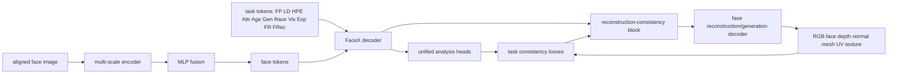

# UFaceNet Architecture

## Core Idea

UFaceNet uses an independently implemented shared face encoder, multi-scale fusion, and lightweight task-token decoder that processes face tokens and task tokens together.

The extension is a first-class reconstruction/generation branch:

- add `T_frec`, a learnable face reconstruction/generation token;
- optionally split it into geometry, texture, and render tokens after the first ablation;
- use a reconstruction-consistency block, not just an isolated image decoder;
- evaluate the branch with rFID, FID-face, identity, geometry, and original-task regression metrics.

## Block Diagram



## Why This Block Can Be Better

Prior unified face models use task tokens to extract task-specific representations from a shared face representation. UFaceNet can make reconstruction useful by turning it into a consistency signal for the whole block:

- Landmarks constrain reconstructed geometry.
- Head pose constrains camera and render alignment.
- Parsing constrains semantic face regions.
- Expression constrains mouth, eye, and brow geometry.
- Face recognition constrains identity preservation.
- Age/gender/race/attributes test whether reconstruction preserves semantic face cues without forcing the generator to invent them.

The desired result is not only a generated face. The desired result is a reconstruction pathway that exposes whether the shared representation contains enough geometry, identity, expression, and semantic detail to reconstruct a faithful face.

## Proposed Modules

### 0. Independent Source Boundary

All active implementation lives in `ufacenet/`. Do not vendor or import FaceXFormer code, and do not load FaceXFormer checkpoints. Published FaceXFormer values may be cited as baselines in papers and ledgers, but UFaceNet training and evaluation must use UFaceNet code.

### 1. Task Registry

Create a registry that defines:

- task id
- task name
- token count
- output head
- loss
- metric
- dataset split
- inference serializer

This avoids hard-coding task ids in `inference.py` and makes FRec an ordinary task in the system.

### 2. FRec Tokens

Start with one token:

- `T_frec`: drives image reconstruction/generation.

Then ablate a three-token version:

- `T_geom`: FLAME, depth, normal, or mesh coefficients.
- `T_tex`: albedo, UV texture, or appearance code.
- `T_render`: camera/light/render consistency.

Keep the one-token version as the simplest baseline.

### 3. Reconstruction-Consistency Block

Inputs:

- refined face tokens from FaceX;
- `T_frec` output token;
- optional predictions from existing task heads, detached during early stages.

Outputs:

- reconstructed aligned RGB face;
- optional face mask;
- optional depth/normal maps;
- optional FLAME or 3DMM parameters;
- optional UV texture/albedo.

The block should support two modes:

- paired reconstruction: reconstruct the input face crop;
- controlled generation/refinement: generate a face from the UFaceNet latent and optional task controls.

### 4. Decoder Options

Baseline decoder:

- convolutional upsampler from fused face feature map and `T_frec`;
- outputs 224 x 224 or 256 x 256 RGB.

Geometry decoder:

- predicts FLAME or 3DMM coefficients;
- uses differentiable rendering for RGB, depth, normal, silhouette, and landmark supervision.

Generative decoder:

- lightweight VAE/VQ decoder or diffusion refiner conditioned on FaceX tokens;
- used only after the baseline reconstruction path is stable.

### 5. One-Pass Output Contract

UFaceNet should expose a single forward path that accepts an image and a requested task set. The output dictionary should support simultaneous task outputs:

- `analysis`: FP, LD, HPE, Attr, Age, Gen, Race, Vis, Exp, and FR outputs when requested;
- `frec`: reconstructed RGB and optional generated/refined RGB;
- `geometry`: optional depth, normals, mesh or 3DMM parameters, UV texture, mask, camera, and lighting;
- `consistency`: metric-ready intermediate predictions used for identity, landmark, pose, parsing, expression, and geometry checks.

The optional high-fidelity refiner may be internally staged, but it should be conditioned by UFaceNet tokens/features and wrapped behind the same FRec interface.

## Loss Design

Start simple and add terms one at a time:

```text
L_total =
  L_analysis_tasks
  + lambda_rgb * L1(recon, image)
  + lambda_lpips * LPIPS(recon, image)
  + lambda_id * (1 - cos(phi_id(recon), phi_id(image)))
  + lambda_landmark * NME(landmarks(recon), landmarks(image))
  + lambda_pose * MAE(pose(recon), pose(image))
  + lambda_parse * CE(parse(recon), parse(image))
  + lambda_geom * geometry_loss
```

Use detached teacher predictions for consistency in early experiments. Allow gradients through the shared task heads only after the reconstruction branch stops destabilizing original tasks.

## Training Stages

Stage 0: Independent baseline setup

- Validate UFaceNet one-pass inference and training from scratch.
- Reproduce paper-like task metrics on configured splits or document dataset/protocol blockers.

Stage 1: Frozen reconstruction head

- Freeze backbone and FaceX decoder.
- Train only FRec token and reconstruction decoder.
- Metrics: rFID, FID-face, LPIPS, PSNR, SSIM, ID cosine.

Stage 2: Consistency block

- Add detached task consistency losses from landmarks, pose, parsing, expression, and identity.
- Metrics: paired metrics plus consistency metrics.

Stage 3: Joint UFaceNet fine-tuning

- Unfreeze selected decoder layers.
- Use balanced task sampling and loss weighting.
- Track original task regressions.

Stage 4: Generative refinement

- Add VAE/VQ/diffusion refinement if paired reconstruction is stable.
- Report rFID, FID-face, identity preservation, and speed separately from the lightweight branch.

## Ablations Required For ACCV

- UFaceNet analysis-only baseline, no FRec.
- UFaceNet with isolated FRec decoder, no consistency block.
- UFaceNet with reconstruction-consistency block.
- One FRec token versus geometry/texture/render tokens.
- No identity loss.
- No landmark/pose consistency.
- No parsing consistency.
- Frozen backbone versus partial unfreeze.
- Conv decoder versus geometry-aware decoder.
- With and without generative refiner.

## Main Figure Plan

Figure A: UFaceNet analysis-only block and UFaceNet with FRec block.

Figure B: reconstruction outputs:

- input face
- UFaceNet reconstruction
- face parsing
- landmarks
- pose
- expression
- depth/normal/mesh if available

Figure C: failure cases:

- heavy occlusion
- profile face
- extreme expression
- low resolution
- demographic slices where labels permit analysis
